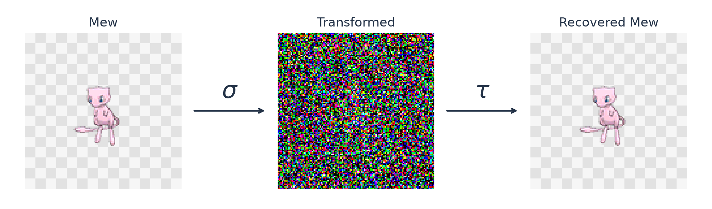
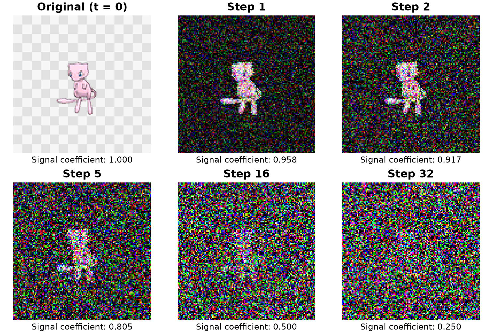
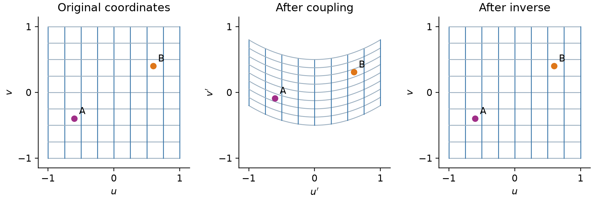

# Teaching data to change form and find its way back

Imagine sending text as an image, or carrying an image as sound, while a receiver recovers the original information.

That possibility motivates our latest research at **Alshival.Ai**. Protecting communication, medical records, and scientific data means preserving information for the people who need it while controlling what others can learn. We are studying how information can change form while retaining a reliable way back.

We started with something small and familiar: Pokémon sprites. And, naturally, Mew.

*Image #1 · Figure 1 in the paper. Mew, a training example, passes through the actual model. Recovery uses the full saved values and recorded noise; the center image is a preview.*

Images, text, and sound can all be represented as organized collections of numbers, called tensors. This gives us a common language for describing transformations between them. Text carried as an image would not have to look like the words it contains.

Our starting idea: choose a transformation that can be undone, then teach a model to approximate the forward operation and a corresponding model to reverse it. The framework could accommodate different reversible transformations, with models suited to each task.

For this experiment, we gradually weaken an image's original signal and add random noise. We know how to undo that process when the added noise is available. This lets us measure how closely the model follows the intended transformation and how faithfully it reverses its own output.

*Image #2 · Figure 4 in the paper. One path through the prescribed noise process. These are steps in the transformation, separate from the model's training updates.*

In our original work, two models learned their directions independently. They could reconstruct the training images, but recovery of unfamiliar images remained unresolved.

This time, each building block has an explicit undo operation. It changes one group of image values while keeping another available as a reference, then switches their roles. Working backward restores each group in turn.

Think of bending a coordinate grid while keeping every point distinct. The grid can change shape, yet each point still has a unique way home.

*Image #3 · Figure 6 in the paper. A simple geometric example: the same points remain distinguishable throughout the transformation.*

The architecture supplies that return path before training. Training teaches the adjustments needed to match our chosen noise process.

Across three runs of 2,000 training updates on a consumer GPU, every evaluated image recovered its original color and transparency bytes after rounding. Tests included 81 Pokémon images excluded from training, random static, and simple patterns. We separated training, validation, and testing, although we had examined the test group in earlier exploratory work.

Reliable recovery is one ingredient in encryption. Confidentiality also requires preventing someone without the secret from learning the content. Our prototype does not yet provide that protection. The paper discusses a route toward quantum-resistant systems by combining reversible learned representations with an established secrecy mechanism; a noisy appearance alone cannot establish security.

Text-to-image and image-to-audio are future experiments. Our next step is to test whether those changes of form can preserve the source information just as faithfully.

[Read the paper on Alshival.Ai](https://alshival.ai/research/alshicrypt-multimodal/) · [Explore the code and experiments](https://github.com/Alshival-Ai/alshicrypt-multimodal-oct-2026)

*Samuel Cavazos · Chief Data Scientist, [Alshival.Ai](https://alshival.ai)*

*Dataset: [Pokemon sprite images, shared by yehongjiang on Kaggle](https://www.kaggle.com/datasets/yehongjiang/pokemon-sprites-images).*
